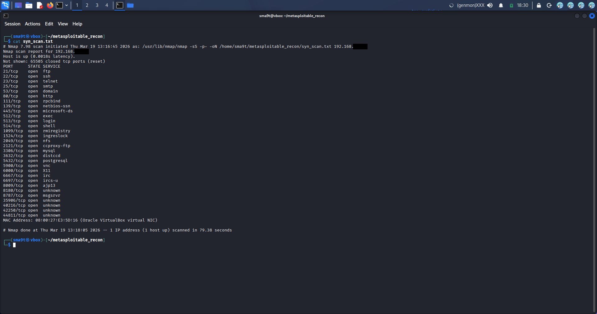
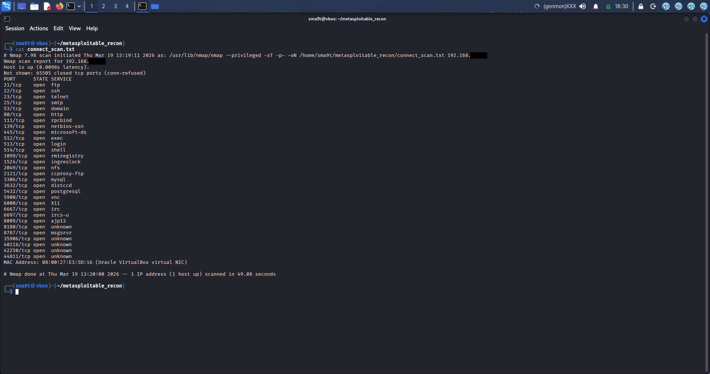
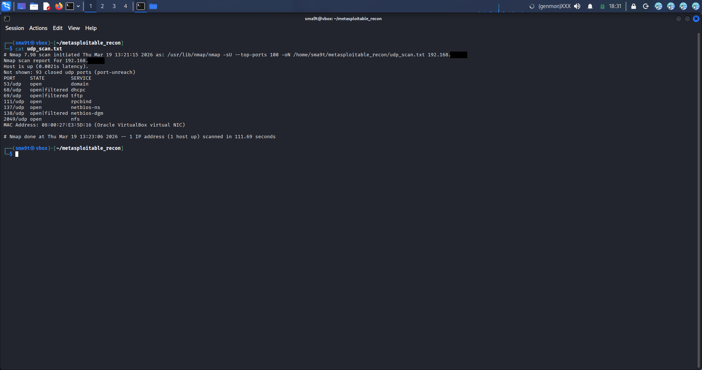
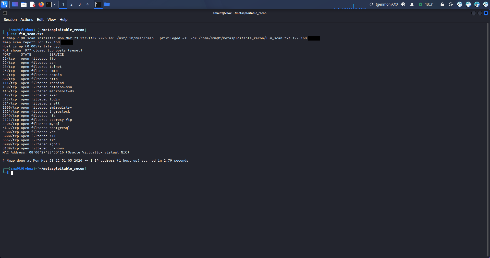
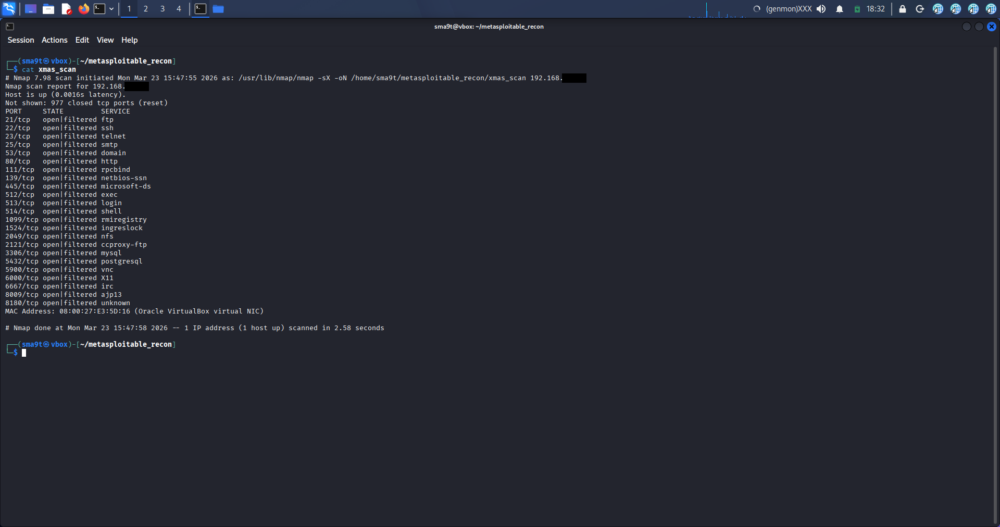
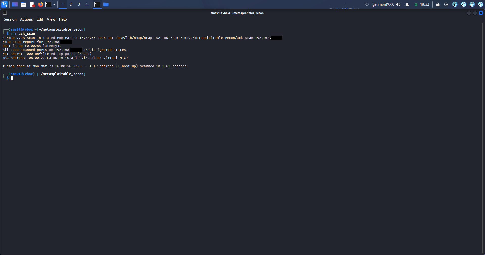

# Metasploitable Recon — Technical Report

## Executive Summary
This report documents a full reconnaissance pass against a Metasploitable VM using Nmap. It covers host discovery, TCP/UDP scanning, and four advanced scan techniques, with an analysis of what each result means for a pen tester and the risks each exposed service represents.

## Project Overview

### Purpose
Practice core Nmap reconnaissance techniques and build an accurate mental model of port states, scan reliability, and stealth trade-offs.

### Key Steps
1. Host discovery (`-sn`)
2. TCP SYN scan (`-sS -p-`)
3. TCP Connect scan (`-sT -p-`)
4. UDP scan (`-sV --top-ports 100`)
5. Advanced scan comparison (FIN, NULL, XMAS, ACK)

## Technical Implementation

### 1. Host Discovery
Before anything else, I ran `SUDO Nmap -sn 192.168.*.**` to confirm the target was reachable. SUDO was used because several later scans require root privileges.

This scan confirmed:

- The host was up
- Its response latency
- Its MAC address, which confirmed the target was a VirtualBox VM

**Using -sn is the standard opening move in network reconnaissance. It focuses strictly on host discovery, making it the fastest way to map live targets. By skipping port scanning entirely, it minimizes packet traffic, keeps the footprint quiet, and reduces the likelihood of triggering security alerts.

**MAC prefix reference:**

| MAC Prefix | Manufacturer |
|---|---|
| 08:00:27 | Oracle VirtualBox |
| 00:50:56 | VMware |
| B8:27:EB | Raspberry Pi |
| 00:00:0C | Cisco |
| 3C:22:FB | Apple |

Recognizing these prefixes matters in real engagements: a Cisco MAC points to a router or switch, an Apple MAC to a Mac or iPhone, and a VMware/VirtualBox MAC to a virtual machine — narrowing down likely targets and exploits before a single port is scanned.

### 2. TCP SYN Scan
Running `SUDO Nmap -sS -p- 192.168.*.**` revealed 30 open TCP ports on the target. Every open port is a potential entry point — one of them, FTP, had already been exploited using the known vsftpd 2.3.4 backdoor.

*SYN scan output showing 30 open TCP ports, including the vulnerable FTP service.*

SYN scans are generally preferred because they're faster than a full connect scan, stealthier (the handshake is never completed), and act as a reliable, universal TCP port checker.

### 3. TCP Connect Scan
A Connect scan (`SUDO Nmap -sT -p- 192.168.*.**`) returned the same open ports as the SYN scan, with two differences:

- It was noticeably slower.
- It was louder, since it completes the full three-way handshake during scanning.

*Connect scan confirming the same 30 open ports as the SYN scan.*

### 4. UDP Scan
A UDP scan (`SUDO Nmap -sV --top-ports 100 192.168.*.**`) returned:

- 93 ports closed (ICMP port-unreachable — confirming nothing was listening)
- 4 ports open: **53** (DNS), **111** (RPC bind), **137** (NetBIOS Name Service), **2049** (NFS)
- 3 ports open/filtered: **68** (DHCP), **69** (TFTP), **138** (NetBIOS Datagram)

*UDP scan showing open DNS, RPC, NetBIOS, and NFS services.*

### 5. Advanced Scan Techniques
Comparing a full-port FIN scan (`SUDO Nmap -sF -p- 192.168.*.**`) against a targeted one (`SUDO Nmap -sF -p 21,22,80 192.168.*.**`) showed a clear difference: the full-port version marked every port as ignored, most likely because sending 65,535 packets in rapid succession overwhelmed the target and caused packet loss. The targeted scan, sending far fewer packets, correctly returned open/filtered results consistent with RFC793 behavior.

*FIN scan showing open|filtered results across scanned ports.*

**Conclusion:** FIN scans are unreliable across a full port range and only dependable when aimed at specific ports.

A NULL scan (`SUDO Nmap -sN 192.168.*.**`) produced the same open/filtered ambiguity as the FIN scan, but is considerably stealthier — NULL packets carry no flags at all, so many firewalls that specifically watch for SYN or ACK traffic let them pass through unnoticed. Beyond stealth, a NULL scan can:

- Hint at the target's OS: Linux/Unix/BSD systems tend to return open/filtered, while Windows systems tend to return all-closed.
- Reveal firewall behavior: an open/filtered result suggests a firewall silently dropping packets, while a closed result (RST returned) means no firewall is present on that port.

*NULL scan showing the same open|filtered ambiguity as the FIN scan.*

An XMAS scan (`SUDO Nmap -sX 192.168.*.**`) behaved the same way as FIN: the full-port version returned an ignored state, while targeting specific ports produced a stable open/filtered result. XMAS scans send the FIN, PSH, and URG flags simultaneously, which is what triggers this ambiguous response under RFC793.

*XMAS scan output, consistent with the FIN and NULL scan results.*

Finally, an ACK scan (`SUDO Nmap -sA 192.168.*.**`) returned all 1000 scanned ports in an **ignored state** rather than a clear unfiltered result. This means the target's responses were likely dropped or rate-limited during the scan, so filtering status could not be conclusively determined from this run — a retest with adjusted timing would be needed to get a reliable result.

*ACK scan showing all 1000 ports in an ignored state — inconclusive, not a confirmed "unfiltered" result.*

## Findings

**Port states, explained:**
| State | Meaning | Response |
|---|---|---|
| Open | Service actively listening | SYN/ACK returned |
| Closed | Port reachable, nothing listening | RST returned |
| Filtered | Firewall/filter blocking the port | No response |
| Open/Filtered | Nmap can't distinguish (common on UDP) | No response either way |

**Scan reliability comparison:**
| Scan | Result | Reliability |
|---|---|---|
| SYN | Most accurate, stealthy, fast | ✅ High |
| Connect | Accurate, slower, no root needed | ✅ High |
| FIN | Open/filtered only | ⚠️ Ambiguous |
| NULL | Cannot confirm open ports | ⚠️ Ambiguous |
| XMAS | Open/filtered only | ⚠️ Ambiguous |
| ACK | Returned ignored/no-response (inconclusive in this run) | ⚠️ Retest needed |

## Risks & Mitigation

| Risk Observed | Why It Matters | Mitigation |
|---|---|---|
| FTP (port 21) running vsftpd 2.3.4 | Known backdoor vulnerability — direct remote code execution | Patch/upgrade FTP service; disable if not required |
| 30 open TCP ports on one host | Large attack surface — every open port is a potential entry point | Close unused services; apply least-privilege network exposure |
| ACK scan returned ignored/no-response on all ports | Result is inconclusive — could indicate rate-limiting rather than an actual firewall state | Retest with adjusted timing (`-T2`/`-T1`) or a smaller port range to get a conclusive filtered/unfiltered result |
| NetBIOS (137/138) and RPC bind (111) exposed | Legacy protocols with a history of enumeration and exploitation | Disable legacy services where not needed; segment on the network |
| NFS (2049) exposed | Misconfigured NFS shares can leak or allow modification of files | Restrict NFS exports to trusted hosts; enforce authentication |
| Full-port FIN/NULL/XMAS scans caused rate-limiting artifacts | Shows the target/network can be destabilized by aggressive scanning | Rate-limit scanning in real engagements; prefer targeted scans over full-port sweeps for accuracy |

## Conclusion
SYN and Connect scans gave the most reliable results; FIN, NULL, and XMAS were only reliable when targeting specific ports rather than the full range. The ACK scan returned an inconclusive, ignored result rather than confirming filtering status, likely due to rate-limiting during the scan, and would need a retest. Several exposed services (FTP, NetBIOS, RPC, NFS) represent real risk if this configuration existed outside a lab environment. Good recon practice means starting quiet (`-sn`, SYN), scaling up only as needed, and always tying findings back to concrete risk and mitigation — not just a list of open ports.
